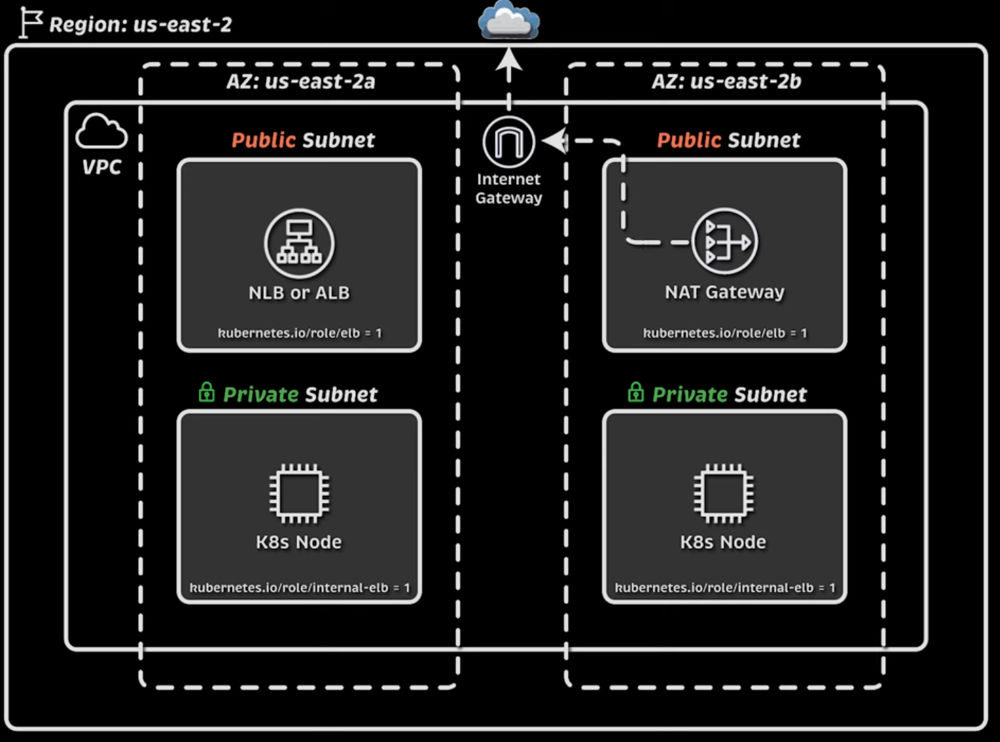
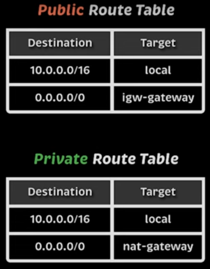
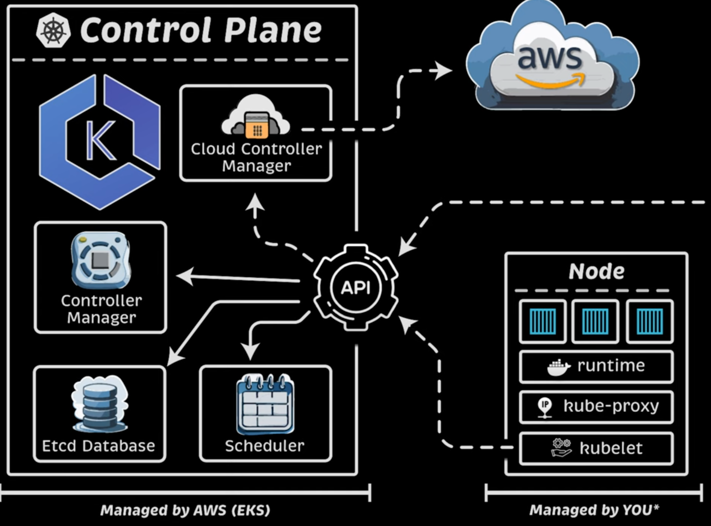
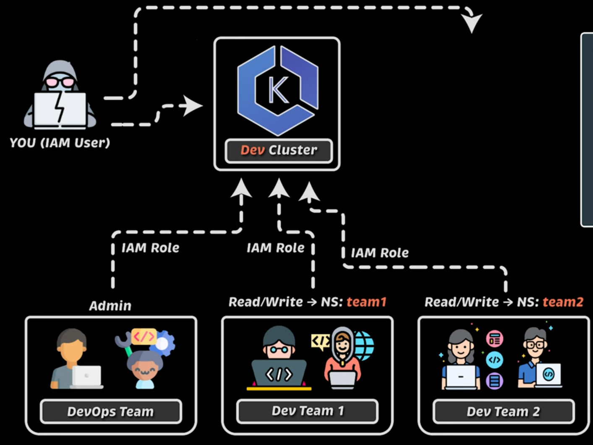

# Crear cluster con Terraform

Terraform va a crear lo siguiente: 
- Create a VPC across three availability zones
- Create an EKS cluster
- Create an IAM OIDC provider
- Add a managed node group named default
- Configure the VPC CNI to use prefix delegation

## Desplegar VPC y configuraciones de red

Vamos a crear:
- 1 VPC
- 2 Subredes públicas
- 2 Subredes privadas
- 1 Internet GW
- 1 Nat GW
- 1 Tabla de ruteo pública
- 1 Tabla de ruteo privada




```bash
terraform init
terraform apply
```

## Desplegar EKS y Nodos

Vamos a crear:
- eks cluster
- nodos



## IAMs permisos



### Viewer

1. Creamos un rol con los siguientes permisos:
```yaml
    resources: ["deployments", "configmaps", "pods", "secrets", "services"]
    verbs: ["get", "list", "watch"]
```
Aplicamos
```bash
kubectl apply -f viewer-role/0-viewer-cluster-role.yaml
```

2. Bindeamos el rol con un grupo que luego crearemos con IAM

Aplicamos
```bash
kubectl apply -f viewer-role/1-viewer-cluster-role-binding.yaml
```

3. Aplicamos el TF `9-add-viewer-user.tf`

4. Crear credenciales para ese user: Por consola, en `IAM > Users > viewer > Security Credentials > Create access key` 

El usuarios se tiene que conectar haciendo:
```bash
aws sso configure --profile viewer
```
y configura las credenciales creadas. 

Luego, configura el cluster
```bash
aws eks update-kubeconfig --name cluster-siu --alias cluster-siu-ueprod --profile viewer
```

Probar
```bash
kubectl auth can-i get pods
```

### Admin

1. En este caso usamos un role ya disponile en el cluster y con permisos de administración

Por lo tanto, directamente, hacemos el binding:
```bash
kubectl apply -f admin-role/admin-cluster-role-binding.yaml
```

