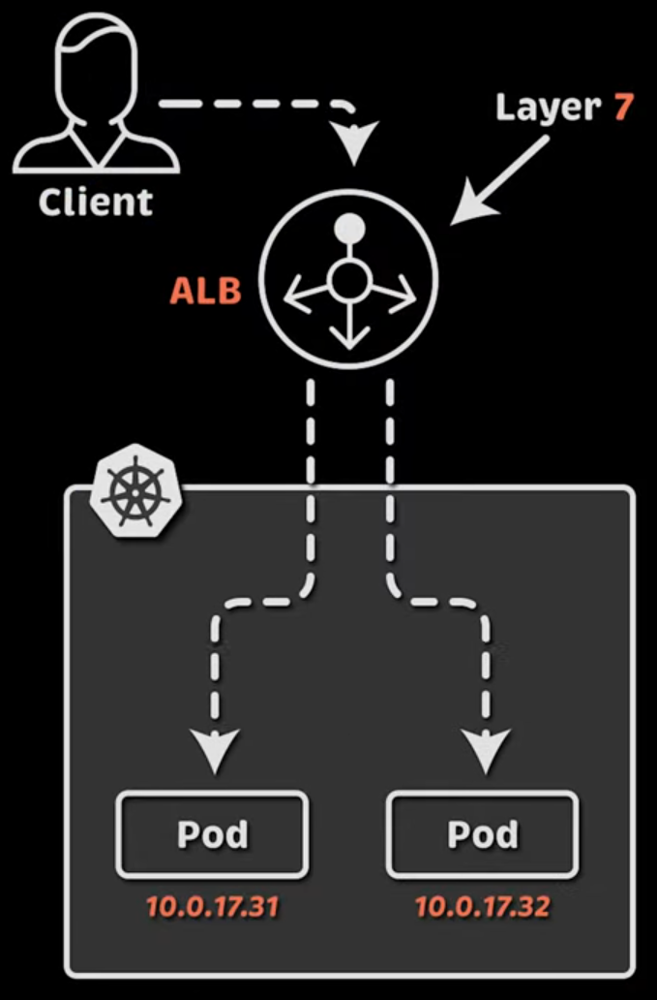
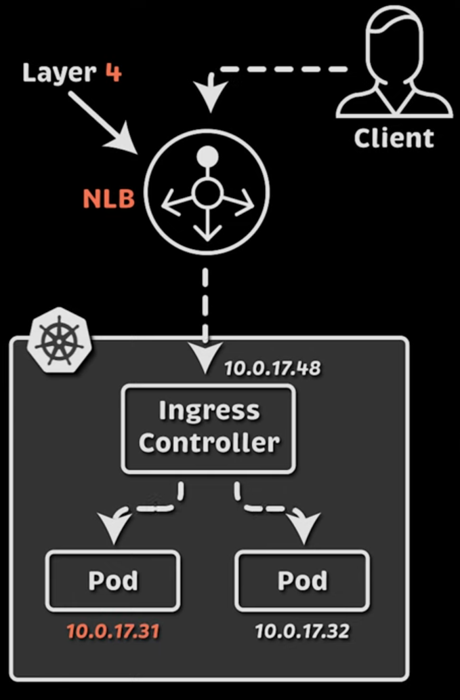
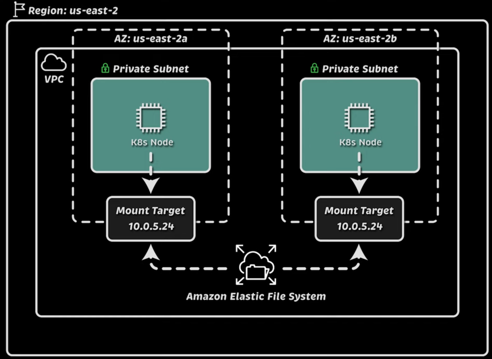

# Crear cluster con Terraform

Terraform va a crear lo siguiente: 
- Create a VPC across three availability zones
- Create an EKS cluster
- Create an IAM OIDC provider
- Add a managed node group named default
- Configure the VPC CNI to use prefix delegation

## Desplegar VPC y configuraciones de red

Vamos a crear:
- 1 VPC
- 2 Subredes públicas
- 2 Subredes privadas
- 1 Internet GW
- 1 Nat GW
- 1 Tabla de ruteo pública
- 1 Tabla de ruteo privada


```bash
terraform init
terraform apply
```

## Desplegar EKS y Nodos

Vamos a crear:
- eks cluster
- nodos


## IAMs permisos


### Viewer

1. Creamos un rol con los siguientes permisos:
```yaml
    resources: ["deployments", "configmaps", "pods", "secrets", "services"]
    verbs: ["get", "list", "watch"]
```
Aplicamos
```bash
kubectl apply -f viewer-role/0-viewer-cluster-role.yaml
```

2. Bindeamos el rol con un grupo que luego crearemos con IAM

Aplicamos
```bash
kubectl apply -f viewer-role/1-viewer-cluster-role-binding.yaml
```

3. Aplicamos el TF `9-add-viewer-user.tf`

4. Crear credenciales para ese user: Por consola, en `IAM > Users > viewer > Security Credentials > Create access key` 

El usuarios se tiene que conectar haciendo:
```bash
aws sso configure --profile viewer
```
y configura las credenciales creadas. 

Luego, configura el cluster
```bash
aws eks update-kubeconfig --name cluster-siu --alias cluster-siu-ueprod --profile viewer
```

Probar
```bash
kubectl auth can-i get pods
```

### Admin

1. En este caso usamos un role ya disponile en el cluster y con permisos de administración

Por lo tanto, directamente, hacemos el binding:
```bash
kubectl apply -f admin-role/admin-cluster-role-binding.yaml
```

2. Aplicamos el tf `10-add-manager-role.tf` 

3. Crear credenciales para ese user: Por consola, en `IAM > Users > manager > Security Credentials > Create access key`

El usuarios se tiene que conectar haciendo:
```bash
aws sso configure --profile manager
```
y configura las credenciales creadas. 

Luego, configura el cluster
```bash
aws eks update-kubeconfig --name cluster-siu --alias cluster-siu-ueprod --profile manager
```

Probar
```bash
kubectl auth can-i "*" "*"
```

## Configurar HELM en el cluster

✔️ Permite a Terraform usar Helm para desplegar aplicaciones en EKS.
✔️ Se usa en módulos de Terraform donde se quiere instalar Prometheus, Nginx, Ingress, Cert-Manager, etc. con Helm.
✔️ No necesita archivos kubeconfig, ya que genera la autenticación en tiempo de ejecución.

Como vamos a usar un nuevo provider, primero hay que inicializar terraform:

```bash
terraform init
```

- Aplicar tf `11-helm-providers.tf`

Probar: 
```bash
k top nodes
k top pod -A
```

## HPA

Para, métricas personalizadas a parte de CPU y RAM utilization: https://www.youtube.com/watch?v=hsJ2qtwoWZw&list=PLiMWaCMwGJXnHmccp2xlBENZ1xr4FpjXF&index=8&pp=iAQB

Prerequisitos:
✔️ Metrics Server debe estar instalado en el cluster. Se usa para obtener el uso de CPU y memoria de los pods.
✔️ El cluster debe permitir el escalado automático, asegurando que haya suficientes nodos disponibles.
✔️ Los pods deben tener requests de CPU y memoria definidos en su Deployment:

```yaml
          resources:
            requests:
              memory: 256Mi
              cpu: 100m
            limits:
              memory: 256Mi
              cpu: 100m
```

Ejemplo de HPA:

```yaml
---
apiVersion: autoscaling/v2
kind: HorizontalPodAutoscaler
metadata:
  name: myapp
  namespace: hpa
spec:
  # Definición del escalado
  scaleTargetRef:
    apiVersion: apps/v1
    kind: Deployment
    name: myapp
  # Definición de Réplicas
  minReplicas: 1
  maxReplicas: 5
  # Métricas de Autoescalado
  metrics:
    # Métrica 1: CPU - Si el uso promedio de CPU en los pods supera el 80%, se escala hacia arriba.
    - type: Resource
      resource:
        name: cpu
        target:
          type: Utilization
          averageUtilization: 80
    # Métrica 2: Memoria - Si el uso promedio de memoria en los pods supera el 70%, Kubernetes escalará hacia arriba.
    - type: Resource
      resource:
        name: memory
        target:
          type: Utilization
          averageUtilization: 70
```

Aplicar ejemplo: 
```bash
k apply -f hpa
```

Chequear HPA:
```bash
k get hpa
```

Hacer escalar la app:
```bash
k port-forward svc/myapp 8080
# La app calcula número fibbonchi y aumenta su CPU
curl "localhost:8080/api/cpu?index=44"
```

## Cluster Autoscaler & EKS Pod Identities

### Cluster Autoscaler

Es un componente externo que se debe instalar para escalar automáticamente el cluster. 

Permisos para que pueda autoescalar con `EKS Pod Identities`:

1. Instalamos el agente de pod identity

¿Para qué sirve eks-pod-identity-agent?

📌 Permite que los pods en Kubernetes usen roles de IAM sin credenciales estáticas.
📌 Mejora la seguridad al eliminar la necesidad de almacenar claves de acceso en los pods.
📌 Facilita el uso de servicios de AWS (S3, DynamoDB, RDS, etc.) desde aplicaciones en EKS.
📍 Ejemplo de uso

    - Se configura un Service Account en Kubernetes.
    - Se asocia ese Service Account a un rol de IAM.
    - Los pods que usan ese Service Account pueden acceder a AWS con permisos específicos.

Aplicamos el tf `13-pod-Identity-addon.tf`

2. Creamos el autoscaler aplicando `14-cluster-autoscaler.tf`

¿Qué hace este código?

- Crea un rol de IAM (aws_iam_role.cluster_autoscaler) que los pods de Cluster Autoscaler pueden asumir.
- Crea una política de IAM (aws_iam_policy.cluster_autoscaler) con permisos para escalar nodos.
- Adjunta la política al rol de IAM (aws_iam_role_policy_attachment.cluster_autoscaler).
- Asocia el rol de IAM con el Service Account de Kubernetes (aws_eks_pod_identity_association.cluster_autoscaler).
- Despliega Cluster Autoscaler con Helm (helm_release.cluster_autoscaler).

```bash
k get pods -n kube-system
```

3. Probamos con un ejemplo: un deployment con 5 réplicas

```bash
k apply -f autoscaler
```

## ALB

Servicio de balanceo de carga de AWS que distribuye el tráfico entrante entre múltiples instancias de backend (EC2, contenedores en ECS, pods en EKS, etc.). Está diseñado para aplicaciones que operan a nivel de capa 7 (HTTP/HTTPS), permitiendo balanceo basado en contenido, reglas avanzadas de enrutamiento y soporte para microservicios.



1. Crear ALB con tf `15-aws-lbc.tf`

### Ejemplo con un service tipo NLB:

**Se configura con las siguientes anotaciones:**

```yaml
# Supported annotations
# https://kubernetes-sigs.github.io/aws-load-balancer-controller/v2.7/guide/service/annotations/
# Example:
  annotations:
    service.beta.kubernetes.io/aws-load-balancer-type: external
    service.beta.kubernetes.io/aws-load-balancer-nlb-target-type: ip
    service.beta.kubernetes.io/aws-load-balancer-scheme: internet-facing
```

**Aplicar**

```bash
k apply -f alb-service
```

**Chequear:**

- Por CLI: `k get svc`

- Por consola web: EC2 > Load balancers (se puede ver que es NLB)

### ALB Ingress

**Se configura con las siguientes anotaciones:**

```yaml
# Supported annotations
# https://kubernetes-sigs.github.io/aws-load-balancer-controller/v2.7/guide/ingress/annotations/
  annotations:
    alb.ingress.kubernetes.io/scheme: internet-facing
    alb.ingress.kubernetes.io/target-type: ip
    alb.ingress.kubernetes.io/healthcheck-path: /health
```

**Aplicar**

```bash
k apply -f alb-ingress
```

**Chequear:**

- Por CLI: `k get ingress`

- Por consola web: EC2 > Load balancers (se puede ver que es tipo Application)
  - En los listeners podemos ver que uno en el puerto 80, y cuyo target group va directo a la IP del pod en el puerto 8080

**Certificados:**

Para perdir certificados, vamos a la consola web a: 

1. Creación de Request:
AWS Certificate Manager > Certificates > Request certificate > Request a public certificate 

2. Una vez creado, tenemos que probar que somos dueños de ese dominio

Entrar al certificate request creado y crear un CNAME record para el DNS en Route53:

AWS Certificate Manager > Certificates > Certificate ID > Domain > Create records in Route 53

Esperar a que status del certificate cambie a `Issued`

Luego enrtar al certificado, copiar el ARN y agregarlo a las anotaciones del ingress ALB creado anteriormente:

```yaml
  annotations:
    alb.ingress.kubernetes.io/certificate-arn: arn:aws:acm:us-east-2:424432388155:certificate/7f32327d-ad95-4977-91c2-8fae85e9e598
    alb.ingress.kubernetes.io/listen-ports: '[{"HTTP": 80}, {"HTTPS":443}]'
    alb.ingress.kubernetes.io/ssl-redirect: "443"
    alb.ingress.kubernetes.io/scheme: internet-facing
    alb.ingress.kubernetes.io/target-type: ip
    alb.ingress.kubernetes.io/healthcheck-path: /health
```

Aplicar y 

> Estudiar cómo hacerlo sin Route53

## NGINX Ingress



1. Aplicar tf `16-nginx-ingress.tf`

2. **Chequear:**

- Por CLI: `k get ingress` y `k get svc`

- Por consola web: EC2 > Load balancers (se puede ver que es tipo NLB)
  - En los listeners podemos ver que uno en el puerto 80, y cuyo target group va directo a la IP del pod del ingress controller 

3. Aplicar tf `17-cert-manager.tf`

4. Creamos cluster issuer

```bash
k apply -f cluster-issuer
```

5. Ejemplo:

```bash
k apply -f nginx-ingress
```

6. Chequear

```bash
k get certificate
k describe certificate
k describe CertificateRequest
k describe Order
k describe Challenge
```

7. Crear CNAME record en el DNS, apuntando nuestro dominio al NLB del ingress

## EBS

Útil cuando creamos aplicaciones stateful. Solo puede atacharse a un pod (ReadWriteOnce)

1. Aplicar tf `18-ebc-csi-driver.tf`

2. Ejemplo statefull app

```bash
k apply -f ebs
k get pvc
```

## EFS
Este storage tiene las siguientes características:
- **Es completamente elástico:** No hace falta especificar el tamaño del volumen, escala automáticamente cuando agregas o removes archivos
- **ReadWriteMany mode:** Se pueden montar múltiples pods al volumen al mismo tiempo
- **Es mucho mas caro que EFS**



Para conectarnos, no podemos usar pod identity porque aún no lo soporta. La mejor forma es usando OpenID y linkearlo a un Service Account

1. Aplicar `19-openid-connect-provider.tf`

📌 Este Terraform configura un Proveedor de Identidad OIDC en AWS IAM para un clúster EKS.
📌 Es un paso clave para habilitar IRSA (IAM Roles for Service Accounts) en Kubernetes.
📌 Permite que los pods en EKS asuman roles IAM sin credenciales estáticas.

2. Aplicar `20-efs.tf` (antes `terraform init` porque hay un nuevo provider)

3. Ejemplo

```bash
k apply -f efs
```

4. Chequear

```bash
k get pods
k get pvc
```

En consola web: EFS > Access Points

## AWS Secret Manager