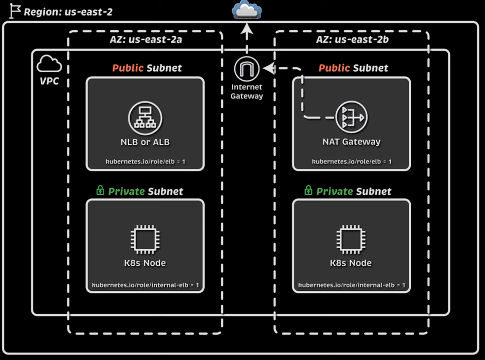
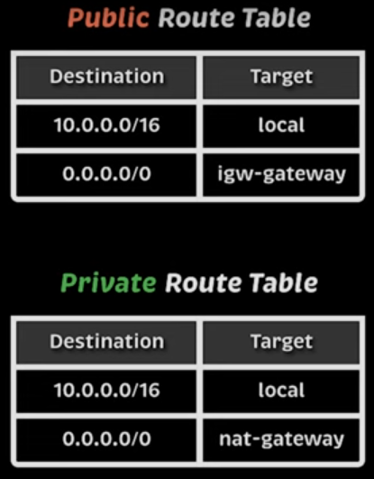

# Crear cluster con Terraform

Terraform va a crear lo siguiente: 
- Create a VPC across three availability zones
- Create an EKS cluster
- Create an IAM OIDC provider
- Add a managed node group named default
- Configure the VPC CNI to use prefix delegation

## Desplegar VPC y configuraciones de red

Vamos a crear:
- 1 VPC
- 2 Subredes públicas
- 2 Subredes privadas
- 1 Internet GW
- 1 Nat GW
- 1 Tabla de ruteo pública
- 1 Tabla de ruteo privada

                 🌍 INTERNET
                     │
     ┌───────────────┴───────────────────┐
     │          Internet Gateway         │  ➝ (Acceso total a Internet)
     └───────────────────────────────────┘
                     │
      ┌──────────────┴───────────────┐
      │       VPC (Red Virtual)      │
      └──────────────────────────────┘
             │                 │
   ┌────────┴─────────┐   ┌────┴────────────────┐
   │  Subnet Pública  │   │ Subnet Privada      │
   │  (Internet OK)   │   │ (Sin acceso directo)│
   └──────────────────┘   └─────────────────────┘
             │                         │
   ┌────────┴───────────┐     ┌────────┴───────────┐
   │  NAT Gateway       │     │  EC2 Privada       │
   │  (Acceso solo saliente) │     │ (No expuesta a Internet) │
   └───────────────────┘     └───────────────────┘
             │
     ┌──────┴──────────┐
     │   Elastic IP    │ (Para que el NAT tenga salida a Internet)
     └────────────────┘





```bash
terraform init
terraform apply
```