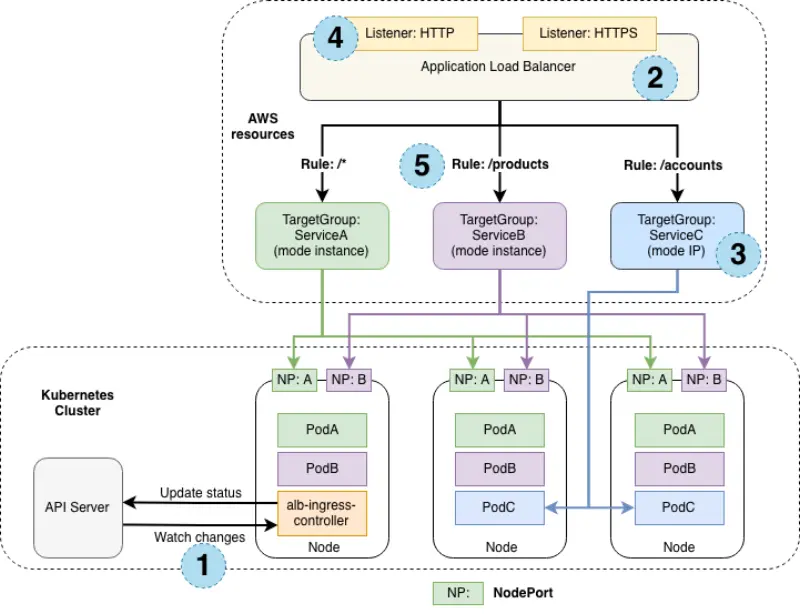

# AWS Load Balancer Controller

AWS Load Balancer Controller es un controlador que ayuda a administrar Elastic Load Balancers para un clúster de Kubernetes.

El controlador puede aprovisionar los siguientes recursos:

- Un Aplication Load Balancer (ALB) de AWS cuando crea un Ingress en Kubernetes.
- Un Network Load Balancer (NLB) de AWS cuando crea un Kubernetes Service de tipo LoadBalancer.

Los ALB funcionan según `L7` del modelo OSI, lo que permite exponer el servicio Kubernetes mediante reglas de entrada y admite el tráfico externo. Los NLB funcionan según `L4` del modelo OSI, lo que permite aprovechar Kubernetes Services para exponer un conjunto de pods como un servicio de red de aplicaciones.

El controlador permite simplificar las operaciones al compartir un ALB entre múltiples aplicaciones en su clúster de Kubernetes.

## Exponer aplicaciones con AWS Load Balancer Controller

### Instalación del controlador

```bash
helm repo add eks-charts https://aws.github.io/eks-charts

helm upgrade --install aws-load-balancer-controller eks-charts/aws-load-balancer-controller \
  --version "${LBC_CHART_VERSION}" \
  --namespace "kube-system" \
  --set "clusterName=${EKS_CLUSTER_NAME}" \
  --set "serviceAccount.name=aws-load-balancer-controller-sa" \
  --set "serviceAccount.annotations.eks\\.amazonaws\\.com/role-arn"="$LBC_ROLE_ARN" \
  --wait
```

### Load Balancer NLB - Instance mode

El siguiente servicio va a crear un Network Load Balancer (NLB)

```bash
apiVersion: v1
kind: Service
metadata:
  name: ui-nlb
  annotations:
    service.beta.kubernetes.io/aws-load-balancer-type: external
    service.beta.kubernetes.io/aws-load-balancer-scheme: internet-facing
    service.beta.kubernetes.io/aws-load-balancer-nlb-target-type: instance
  namespace: ui
spec:
  type: LoadBalancer
  ports:
    - port: 80
      targetPort: 8080
      name: http
  selector:
    app.kubernetes.io/name: ui
    app.kubernetes.io/instance: ui
    app.kubernetes.io/component: service
```

Analisis:

```yaml
service.beta.kubernetes.io/aws-load-balancer-type: external
```
📌 **¿Qué hace?**  
- Define que el servicio **usará un Load Balancer en AWS**.  
- Puede ser un **Application Load Balancer (ALB)** o un **Network Load Balancer (NLB)**.  
- Como más abajo se usa `aws-load-balancer-nlb-target-type: instance`, se creará un **NLB**.  

✔ **Opciones posibles:**  
| Valor  | Tipo de Load Balancer creado |
|--------|------------------------------|
| `external` | Un **NLB o ALB** accesible desde Internet o redes privadas. |
| `nlb` | Un **NLB** específico. |
| `alb` | Un **ALB** específico. |

---

```yaml
service.beta.kubernetes.io/aws-load-balancer-scheme: internet-facing
```
📌 **¿Qué hace?**  
- Define si el Load Balancer **será accesible desde Internet o solo dentro de la VPC**.  
- **`internet-facing`** → Se expone a Internet (tendrá una **IP pública** y será accesible desde cualquier red).  

✔ **Opciones posibles:**  
| Valor | Descripción |
|--------|-------------|
| `internet-facing` | Hace que el NLB tenga IPs públicas y sea accesible desde Internet. |
| `internal` | Crea un NLB solo accesible dentro de la VPC (para tráfico privado). |

---

```yaml
service.beta.kubernetes.io/aws-load-balancer-nlb-target-type: instance
```
📌 **¿Qué hace?**  
- Define **cómo el NLB enruta el tráfico a los pods** en Kubernetes.  
- **`instance`** → El NLB **redirige el tráfico a los nodos EC2** en lugar de a los pods directamente.  

✔ **Opciones posibles:**  
| Valor | Descripción |
|--------|-------------|
| `instance` | Enruta tráfico a los nodos del clúster EKS (requiere que los nodos acepten tráfico en el puerto destino). |
| `ip` | Enruta tráfico directamente a los pods de Kubernetes (requiere que los pods tengan IPs accesibles en la VPC). |

📌 **Diferencia entre `instance` y `ip`:**  
- **`instance` (usado en este ejemplo)** → Se necesita que cada nodo EC2 acepte tráfico en el puerto `8080`.  
- **`ip`** → Cada pod recibe tráfico directamente, sin pasar por los nodos.  

📌 **¿Cuándo usar `instance` vs `ip`?**  
✔ Usa `instance` si los pods pueden moverse entre nodos y no quieres exponer muchas IPs.  
✔ Usa `ip` si necesitas que cada pod maneje tráfico individualmente (mejor para redes privadas).  


Aplicar:
```bash
kubectl apply -f nlb.yaml
kubectl get service -n ui
```

Decribirlo en aws:
```bash
aws elbv2 describe-load-balancers --query 'LoadBalancers[?contains(LoadBalancerName, `k8s-ui-uinlb`) == `true`]'
```
¿Qué nos dice esto?

- La NLB es accesible a través de Internet público.
- Utiliza las subredes públicas en nuestra VPC

We can also inspect the targets in the target group that was created by the controller:

También podemos inspeccionar los `target group` que fue creado por el controlador:

```bash
ALB_ARN=$(aws elbv2 describe-load-balancers --query 'LoadBalancers[?contains(LoadBalancerName, `k8s-ui-uinlb`) == `true`].LoadBalancerArn' | jq -r '.[0]')

TARGET_GROUP_ARN=$(aws elbv2 describe-target-groups --load-balancer-arn $ALB_ARN | jq -r '.TargetGroups[0].TargetGroupArn')

aws elbv2 describe-target-health --target-group-arn $TARGET_GROUP_ARN
```

### Load Balancer NLB - IP mode

Como se mencionó anteriormente, el NLB que creamos opera en modo `instance`. Este modo admite pods que se ejecutan en instancias de AWS EC2. En este modo, AWS NLB envía tráfico a las instancias y, `kube-proxy` lo reenvía a los pods a través de uno o más nodos.

En el modo IP, el NLB envía tráfico directamente a los pods de Kubernetes detrás del servicio, eliminando la necesidad de un salto de red adicional a través de los nodos de trabajo del clúster de Kubernetes. Esto significa que en lugar de registrar las instancias de EC2 en nuestro clúster EKS, el controlador del balanceador de carga ahora registra pods individuales y envía el tráfico directamente, aprovechando la CNI de AWS VPC y el hecho de que cada pod tiene una dirección IP de VPC de primera clase.  



Hay varias razones por las que podríamos querer configurar el NLB para que funcione en modo IP:

- Crea una ruta de red más eficiente para las conexiones entrantes, sin pasar `kube-proxy` por el nodo de trabajo EC2
- Elimina la necesidad de considerar aspectos como `externalTrafficPolicy`. 
- Una aplicación se está ejecutando en Fargate en lugar de EC2

### Ingress

Ejemplo:
```yaml
apiVersion: networking.k8s.io/v1
kind: Ingress
metadata:
  name: ui
  namespace: ui
  annotations:
    alb.ingress.kubernetes.io/scheme: internet-facing
    alb.ingress.kubernetes.io/target-type: ip
    alb.ingress.kubernetes.io/healthcheck-path: /actuator/health/liveness
spec:
  ingressClassName: alb
  rules:
    - http:
        paths:
          - path: /
            pathType: Prefix
            backend:
              service:
                name: ui
                port:
                  number: 80
```

📌 **¿Qué hacen estas anotaciones?**  

| Anotación | Explicación |
|------------|------------|
| `alb.ingress.kubernetes.io/scheme: internet-facing` | El **ALB** será accesible desde Internet, asignándole una **IP pública**. Si quisieras que solo funcione dentro de la VPC, deberías cambiarlo a `internal`. |
| `alb.ingress.kubernetes.io/target-type: ip` | El ALB enviará tráfico **directamente a las IPs de los pods** en Kubernetes. Si fuera `instance`, el tráfico se enviaría a los **nodos del clúster** en lugar de a los pods. |
| `alb.ingress.kubernetes.io/healthcheck-path: /actuator/health/liveness` | Define la URL `/actuator/health/liveness` como la ruta que el ALB usará para verificar si los pods están activos y saludables. Si no responden, el ALB dejará de enviarles tráfico. |

Inspeccionar en aws:
```bash
aws elbv2 describe-load-balancers --query 'LoadBalancers[?contains(LoadBalancerName, `k8s-ui-ui`) == `true`]'
```

Que nos dice la salida de este comando?

- El  ALB es accesible en internet
- Usa redes públicas de nuestro VPC

Si queremos visualizar los target de este ingress:

```bash
ALB_ARN=$(aws elbv2 describe-load-balancers --query 'LoadBalancers[?contains(LoadBalancerName, `k8s-ui-ui`) == `true`].LoadBalancerArn' | jq -r '.[0]')

TARGET_GROUP_ARN=$(aws elbv2 describe-target-groups --load-balancer-arn $ALB_ARN | jq -r '.TargetGroups[0].TargetGroupArn')

aws elbv2 describe-target-health --target-group-arn $TARGET_GROUP_ARN
```
Qué nos dice la salida de este comando?

Ya que usamos la annotation `b.ingress.kubernetes.io/target-type: ip`, el target es registrado usando la IP del pod donde queremos mandar el tráfico. 

### Múltiple Ingress

La función IngressGroup, que permite agrupar varios recursos de Ingress. El controlador fusionará automáticamente las reglas de Ingress para todos los Ingress dentro de IngressGroup y las gestionará con un único ALB. De esa manera, nos evitamos la creación de múltiples ALB. 

```yaml
apiVersion: networking.k8s.io/v1
kind: Ingress
metadata:
  name: ui-multi
  namespace: ui
  labels:
    app.kubernetes.io/created-by: eks-workshop
  annotations:
    alb.ingress.kubernetes.io/scheme: internet-facing
    alb.ingress.kubernetes.io/target-type: ip
    alb.ingress.kubernetes.io/healthcheck-path: /actuator/health/liveness
    alb.ingress.kubernetes.io/group.name: retail-app-group
spec:
  ingressClassName: alb
  rules:
    - http:
        paths:
          - path: /
            pathType: Prefix
            backend:
              service:
                name: ui
                port:
                  number: 80

---

apiVersion: networking.k8s.io/v1
kind: Ingress
metadata:
  name: catalog-multi
  namespace: catalog
  labels:
    app.kubernetes.io/created-by: eks-workshop
  annotations:
    alb.ingress.kubernetes.io/scheme: internet-facing
    alb.ingress.kubernetes.io/target-type: ip
    alb.ingress.kubernetes.io/healthcheck-path: /health
    alb.ingress.kubernetes.io/group.name: retail-app-group
spec:
  ingressClassName: alb
  rules:
    - http:
        paths:
          - path: /catalogue
            pathType: Prefix
            backend:
              service:
                name: catalog
                port:
                  number: 80

```

Podemos ver que agrupa los Ingress en un único ALB por medio de la etiqueta `alb.ingress.kubernetes.io/group.name: retail-app-group`

Detalles de los listeners del ALB:
```bash
ALB_ARN=$(aws elbv2 describe-load-balancers --query 'LoadBalancers[?contains(LoadBalancerName, `k8s-retailappgroup`) == `true`].LoadBalancerArn' | jq -r '.[0]')
LISTENER_ARN=$(aws elbv2 describe-listeners --load-balancer-arn $ALB_ARN | jq -r '.Listeners[0].ListenerArn')
aws elbv2 describe-rules --listener-arn $LISTENER_ARN
```

